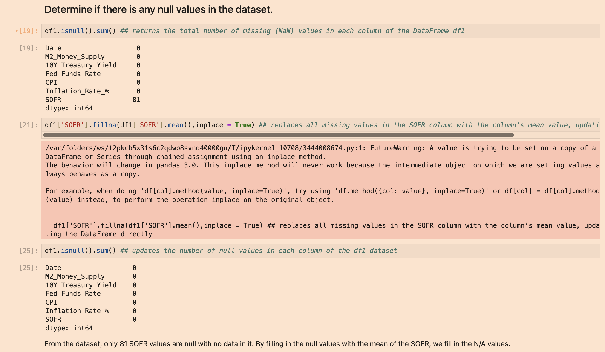

# Macroeconomic Data Project using macro_data_25yrs.csv Dataset
<a href="MacroeconomicDataProject.ipynb" download>View Jupyter Project File</a>

### Program Overview
This project analyzes macroeconomic data spanning the past 7 years to explore relationships between key financial indicators and to develop forecasting models. The dataset includes features such as __M2 money supply__, __10-year Treasury yield__, __Federal Funds Rate__, __Consumer Price Index (CPI)__, __inflation rate__, and __SOFR__. The workflow involves data loading, preprocessing, feature engineering (e.g., yield spread, moving averages, volatility measures), correlation analysis, and time-series modeling.

### __Tool 1__: Data Loading and Preprocessing
- Necessary libraries such as pandas, seaborn, and matplotlib are imported, and the Macroeconomic Data dataset (macro_data_25yrs.csv) is uploaded into df and copied as df1 for purposes of analysis. The first ten rows are displayed to inspect the variables. Null (NaN) values are replaced with the mean of the column values. In this case, SOFR was the only column with null values, so its 81 values were filled in with the column mean.

### __Tool 2__: Feature Engineering and Correlation Analysis
Feature engineering was applied to enhance the predictive power and analytical depth of the macroeconomic dataset. New variables such as yield spread (10-year Treasury yield minus the Federal Funds Rate) and 30-day moving averages were created to capture trends, momentum, and variability in economic indicators over time. Correlation analysis was then conducted to identify relationships between variables, revealing strong connections such as the high correlation between long-term and short-term interest rates, as well as between M2 money supply and CPI. These engineered features and correlation insights provide a stronger foundation for modeling, enabling more accurate forecasts and a deeper understanding of macroeconomic dynamics.

### __Tool 3__: Time Series Modeling
Using multiple libraries such as matplotlib, pyplot, and seaborn, time series models were created to visualize certain variables over time (either using Date or Year). To graph by using the year, we use the pandas datetime function to convert the date so we have the year and month. This way, when plotting our graphs, we have just the years in the x-axis. 

Time Series 1:

Using matplotlib, we find the Federal Funds Rate over the last 7 years. Our x- and y-axis are labeled, the title is present, and a line is displayed to show what the Federal Funds Rate was from 2018-2025. As seen above:

- Between 2018 and 2019, the rate hovered from 1-2.5%
- From 2020 to 2021, the rate dropped to close to 0% due to the pandemic.
- After 2022, rates were hiked to over 5% due to growing inflation from the amount of borrowing that occurred to keep the economy afloat during shutdowns.
- From late 2024 to now, the rate has dropped to around 4.75% but the trajectory of the economy at the time is uncertain to lower the rate further.

Time Series 2:

Switching now to pandas, we figure out the relationship between the Federal Funds Rate and the inflation rate percentage from 2018-2025. By utilizing pandas, it is easier to have all graphing details in one to two lines, versus matplotlib, where each line is an assigned plotted variable. From the graph, we can see:

- Inflation and interest rates stayed close together before the 2020 pandemic.
- Once the pandemic comes around in 2020, inflation is below 2% and the interest rates stay close to 0%.
- In 2021, we see inflation spiking to close to 9%, with a delayed reaction in interest rates going up to 4-5%.
- When inflation cools after 2022, the Federal Reserve lowers interest rates cautiously to avoid further inflation from occurring.

As you can see, there is likely a correlation between these two variables. When inflation rises, the federal funds rate increases to ease consumption. The same applies when inflation decreases.

Time Series 3:

Lastly, the provided Seaborn pairplot visualizes the relationships between key economic indicators, including M2 Money Supply, 10-Year Treasury Yield, Federal Funds Rate, Consumer Price Index (CPI), Inflation Rate, and SOFR (Secured Overnight Financing Rate). The plot features a 6x6 grid where each cell represents a scatter plot or histogram, comparing one variable against another or itself. The diagonal cells display histograms of individual variables, while off-diagonal cells show scatter plots with data points, highlighting correlations and distributions. The plot uses a consistent blue color scheme and includes a height scaling factor of 1.5, enhancing the clarity of the data trends and patterns observed across these financial metrics as of the data's context.

To go into a couple of the plots, let's see their correlation:
- The scatter plot of M2 Money Supply versus 10-Year Treasury Yield shows a general upward trend, suggesting a positive correlation as money supply increases with higher yields.
- The histogram of the Inflation Rate highlights a right-skewed distribution, indicating that lower inflation rates are more common in the dataset.

